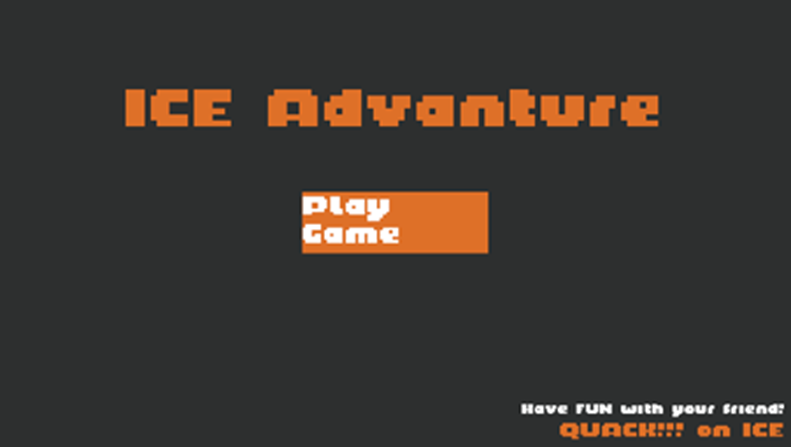
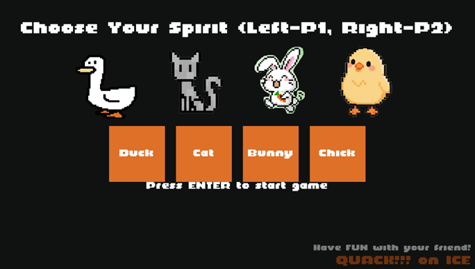
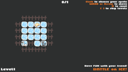
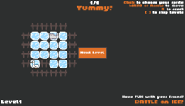
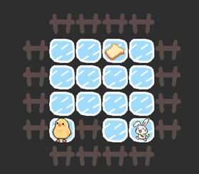
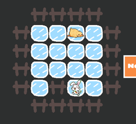
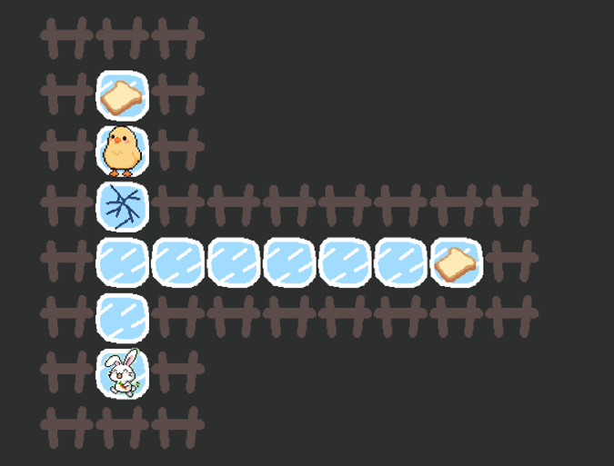
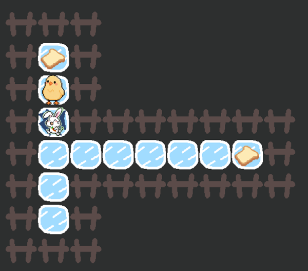

# Battle on Ice

[TOC]

## **一、安装与启动**

**下载游戏安装包**：从GitHub网站下载游戏安装包。

**解压文件**：将下载的安装包解压到一个指定的文件夹中。

**运行程序**：进入解压后的文件夹，运行启动程序。

## **二、游戏操作与用户界面说明**

使用方法：

1 一个终端cargo run -- --server 

2 一个终端cargo run -- --player1 --connect 服务器IP地址

3 一个终端cargo run -- --player2 --connect 服务器IP地址

2个客户端的游戏状态是同步的。

 

在游戏开始界面，点击play game开始游戏：

在人物选择界面，鼠标左键选择Player1人物，右键选择Player2人物，点击enter键开始游戏。

 

[人物选择]

在游戏界面，Player1使用WASD移动小动物，Player2使用↑↓←→键移动小动物。R键重新开始当前所在关卡， [ 键 选择上一关，]键选择下一关。在游戏上方设有得分板，可以看到当前进度与目标进度，双人协作吃到所有面包后，当前关卡结束。

[游戏界面]：

     

[游戏-开始-通关 ] 

游戏中设置了独特的动画效果，流畅自然，并且搭配了对应的音效，提高游戏体验。如小动物吃到面包后会变成圆滚滚的吃饱形态，此时搭配吃东西的音效。小动物碰到破碎的冰块会陷入冰中，此时搭配冰块碎裂的音效。小动物撞到围栏上会有碰撞效果等。

     
[小鸡-变为吃饱状态]
[小动物吃到面包之后就会变成吃饱的小动物]

     

[小兔子-碰到破碎的冰块🧊，无法移动]

[当小动物碰到破碎的冰块之后就无法动弹]

完成最后一关会来到结束界面。结束庆祝界面有四只小动物的切换动画，非常有趣。点击exit退出游戏，或点击main menu回到游戏开始界面，可以再次闯关。

 

 

[结束庆祝界面]

 

**玩家一**：

**移动**：使用键盘的WASD键控制角色移动。

**玩家二**：

**移动**：使用键盘的↑↓←→键控制角色移动。

 

## **三、关卡说明**

游戏包含20个精心设计的关卡。关卡基本逻辑包括开始、胜利、重新开始等。2位玩家在完成关卡目标（吃到所有的面包）后能可以顺利进入下一关。同时，我们也为关卡添加了一些特殊逻辑，如破碎的冰块，这增加了游戏的趣味性。

关卡间难度递进，地图复杂度提升，逐步考验玩家的想象力和团队协作能力。并且，关卡的通关路径不唯一，可以采取不同的顺序与策略吃到所有面包，避免了游戏过程的单调性，玩家可以在闯关过程中不断探索，保持新鲜感和挑战欲。关卡经过测试，能确保每关都至少有一种通关路径。根据测试反馈，我们调整了一些关卡的难度和布局，确保每个关卡都能为玩家带来独特的挑战和乐趣。

 

[ 示例关卡1 ]

 

[ 示例关卡2 ]

 

[ 示例关卡3 ]

 

## **四、注意事项**

为了确保游戏的稳定性和流畅性，建议使用稳定的网络连接。

若当前网络环境存在较高延迟或丢包率，可以选择本地双人模式，在同一主机上开启终端，不输入服务器IP，系统会默认本地模式。

 
